# Streamwall Ecosystem

A comprehensive livestream management platform that monitors, aggregates, and displays streams from multiple platforms in real-time.

## 🎯 Overview

The Streamwall ecosystem is a collection of microservices that work together to:
- **Discover** livestreams from Discord channels and Twitch chat
- **Store** stream metadata in a centralized API backend
- **Monitor** stream status in real-time
- **Display** multiple streams in a customizable mosaic layout

## 📂 Repository Structure

This is a **meta-repository** that orchestrates multiple services using Git submodules:

```
streamwall/                    # This repository (orchestration layer)
├── streamsource/             # Git submodule: Rails API backend
├── livestream-link-monitor/  # Git submodule: Discord/Twitch bot
├── livesheet-checker/        # Git submodule: Stream status checker
├── streamwall/               # Git submodule: Electron desktop app
├── docker-compose.yml        # Unified service orchestration
├── Makefile                  # Common commands
├── tests/integration/        # Cross-service integration tests
└── docs/                     # Ecosystem documentation
```

Each service is maintained in its own repository and included here as a submodule for easy orchestration.

## 🏗️ Architecture

```mermaid
graph TD
    subgraph "External Sources"
        Discord[Discord Channels]
        Twitch[Twitch Chat]
        Manual[Manual Entry]
    end
    
    subgraph "Stream Discovery"
        Monitor[livestream-link-monitor<br/>• Monitors Discord/Twitch<br/>• Platform detection<br/>• Metadata extraction]
    end
    
    subgraph "Data Storage"
        Sheets[Google Sheets<br/>Legacy/Backup]
        API[StreamSource API<br/>Rails 8 Backend<br/>• REST API<br/>• WebSockets<br/>• PostgreSQL + Redis]
    end
    
    subgraph "Background Workers"
        Checker[livesheet-checker<br/>• Status monitoring<br/>• Data synchronization]
    end
    
    subgraph "Client Applications"
        Wall[Streamwall<br/>• Electron desktop app<br/>• Mosaic layout<br/>• Audio controls]
    end
    
    Discord --> Monitor
    Twitch --> Monitor
    Manual --> API
    
    Monitor -->|Dual-write| Sheets
    Monitor -->|Primary| API
    
    Sheets <-->|Sync| Checker
    Checker -->|Update status| API
    
    API -->|GET /api/v1/streams| Wall
    API -->|WebSocket updates| Wall
    
    style API fill:#e1f5e1
    style Wall fill:#e1e5f5
    style Monitor fill:#f5e1e1
```



## 📦 Services

### Core Services

#### 1. **StreamSource** (Rails 8 API)
- Central data store for all stream metadata
- RESTful API with JWT authentication
- Real-time updates via ActionCable WebSocket
- Admin interface for stream management
- Feature flags for gradual rollouts

#### 2. **livestream-link-monitor** (Node.js)
- Discord bot that monitors channels for stream URLs
- Twitch chat integration for stream discovery
- Automatic platform detection (Twitch, YouTube, TikTok, Kick, Facebook)
- Location parsing from messages
- Dual-write capability to both Google Sheets and StreamSource API

#### 3. **livesheet-checker** (Node.js)
- Monitors stream status (live/offline)
- Updates Google Sheets with current status
- Syncs data between Google Sheets and StreamSource API
- Configurable check intervals

#### 4. **Streamwall** (Electron)
- Desktop application for viewing multiple streams
- Customizable grid layouts
- Per-stream audio controls
- Keyboard shortcuts for quick navigation
- Web-based remote control interface

### Infrastructure Services

- **PostgreSQL 17** - Primary database for StreamSource
- **Redis 7** - Caching and ActionCable support
- **Nginx** - Reverse proxy (production)

## 🚀 Quick Start

### Prerequisites
- Docker & Docker Compose
- Git

### Setup

1. **Clone and setup**
   ```bash
   git clone --recursive https://github.com/streamwall/streamwall-suite.git
   cd streamwall-suite
   ./setup-ecosystem.sh
   ```

2. **Start all services**
   ```bash
   docker-compose up -d
   ```

3. **Access the services**
   - StreamSource API: http://localhost:3000
   - API Documentation: http://localhost:3000/api-docs
   - Streamwall: Run `cd streamwall && npm run start:app`

### Development with Default Configuration

The setup script creates a working development environment with:
- PostgreSQL database (user: `streamsource`, password: `streamsource_password`)
- Redis for caching and real-time features
- Auto-generated secure keys for JWT and Rails
- Example Google Sheets credentials (update with your own for full functionality)

No configuration required to get started! The defaults work for local development.

## 🔧 Development

### Running Services Individually

```bash
# Start StreamSource API
cd streamsource
docker-compose up

# Start livestream monitor
cd livestream-link-monitor
npm install
npm run dev

# Start livesheet checker
cd livesheet-checker
docker-compose up

# Start Streamwall desktop app
cd streamwall
npm install
npm run start:app
```

### Running Tests

```bash
# Run all integration tests
make test-integration

# Run specific service tests
cd streamsource && bundle exec rspec
cd livestream-link-monitor && npm test
cd streamwall && npm test
```

### API Documentation

- StreamSource API: http://localhost:3000/api-docs (when running)
- See [API_INTERFACES.md](docs/API_INTERFACES.md) for detailed endpoint documentation

## 📊 Integration Tests

The ecosystem includes comprehensive integration tests that verify:
- Service communication patterns
- Data consistency across services
- Real-time update propagation
- Error handling and recovery
- Performance under load

See [tests/integration/README.md](tests/integration/README.md) for details.

## 🔐 Security

- JWT authentication for API access
- Environment-based configuration
- HTTPS enforced in production
- Rate limiting on all endpoints
- Input validation and sanitization

## 📈 Monitoring

### Health Checks
- `/health` endpoints on all services
- Docker health checks
- Automated restart on failure

### Logging
- Centralized JSON logging format
- Log aggregation ready
- Debug mode for development

### Metrics
- Response time tracking
- Stream discovery rates
- API usage statistics

## 🚢 Deployment

### Docker Compose
```bash
# Production deployment
docker-compose -f docker-compose.production.yml up -d
```

### DigitalOcean
See [streamsource/DIGITALOCEAN_DEPLOYMENT_GUIDE.md](streamsource/DIGITALOCEAN_DEPLOYMENT_GUIDE.md) for cloud deployment instructions.

## 📝 Configuration

### Environment Variables
See [.env.example](.env.example) for all available configuration options.

Key configurations:
- `RAILS_ENV` - Rails environment (development/production)
- `DATABASE_URL` - PostgreSQL connection string
- `REDIS_URL` - Redis connection string
- `DISCORD_TOKEN` - Discord bot token
- `GOOGLE_SHEET_ID` - Google Sheets ID for stream data

### Feature Flags
StreamSource includes feature flags for gradual rollouts:
- `analytics` - Advanced analytics features
- `bulk_import` - Bulk stream import
- `webhooks` - Webhook notifications
- `real_time_notifications` - WebSocket updates

## 🤝 Contributing

1. Fork the repository
2. Create a feature branch (`git checkout -b feature/amazing-feature`)
3. Commit your changes (`git commit -m 'Add amazing feature'`)
4. Push to the branch (`git push origin feature/amazing-feature`)
5. Open a Pull Request

See [CONTRIBUTING.md](CONTRIBUTING.md) for detailed guidelines.

## 📚 Documentation

- [Architecture Overview](docs/ARCHITECTURE.md)
- [API Interfaces](docs/API_INTERFACES.md)
- [Service Communication](docs/SERVICE_COMMUNICATION.md)
- [Deployment Guide](docs/DEPLOYMENT.md)
- [Troubleshooting](docs/TROUBLESHOOTING.md)

### Service-Specific Documentation
- [StreamSource README](streamsource/README.md)
- [Livestream Monitor README](livestream-link-monitor/README.md)
- [Livesheet Checker README](livesheet-checker/README.md)
- [Streamwall README](streamwall/README.md)

## 🐛 Troubleshooting

### Common Issues

1. **Services not starting**
   ```bash
   make doctor  # Run diagnostics
   make logs    # Check service logs
   ```

2. **Database connection errors**
   ```bash
   docker-compose exec postgres psql -U streamsource
   # Check database connectivity
   ```

3. **API authentication failures**
   - Verify JWT token is valid
   - Check token expiration
   - Ensure correct API key in .env

See [docs/TROUBLESHOOTING.md](docs/TROUBLESHOOTING.md) for more solutions.

## 📄 License

This project is licensed under the MIT License - see individual service directories for specific licenses.

## 🙏 Acknowledgments

- Discord.js for Discord integration
- TMI.js for Twitch chat integration
- Ruby on Rails team for the excellent framework
- Electron team for cross-platform desktop support

## 📞 Support

- **Issues**: [GitHub Issues](https://github.com/streamwall/streamwall-suite/issues)
- **Discussions**: [GitHub Discussions](https://github.com/streamwall/streamwall-suite/discussions)
- **Wiki**: [GitHub Wiki](https://github.com/streamwall/streamwall-suite/wiki)